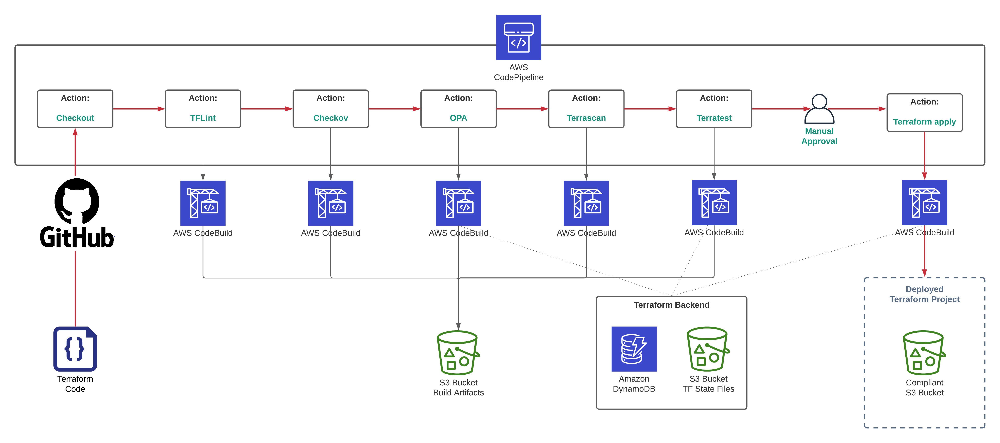

# How to use CodePipeline CICD pipeline to test Terraform modules

This is a demo Terraform repository to set up AWS CodePipeline to test Terraform projects using tflint, Checkov, OPA, Terrascan, and Terratest.

Thanks to @andreivmaksimov for the idea! Additional information can be found in the [How to use CodePipeline CICD pipeline to test Terraform](https://github.com/antonionuma/aws-codepipeline-terraform-cicd-pipeline-demo/) article.


# Take note of some Changes: 
- All configs is set to AWS region "us-east-1"
- The repo used as a source code is Github, connected with codepipeline via codestarconnection (here you have to change pending status to avalaible on console)



## 0 - Set up Terraform remote state infrastructure 

This step is required to set up an infrastructure to store Terraform remote state files

```sh
cd 0_remote_state
terraform init
terraform plan
terraform apply -auto-approve
```

## 1- Set up AWS CodePipeline

This step is required to set up an AWS CodePipeline to test Terraform projects using tflint, Checkov, OPA, Terrascan, and Terratest.

```sh
cd 1_pipeline
terraform init
terraform plan
terraform apply -auto-approve
```

## 2- [Demo S3 Bucket Terraform demo project](https://github.com/antonionuma/2_tf-s3-demo-project/)

Every commit to the code will trigger the pipeline and made all checks, make the manual approval before deploy